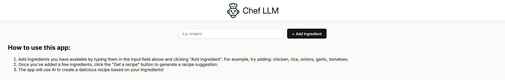
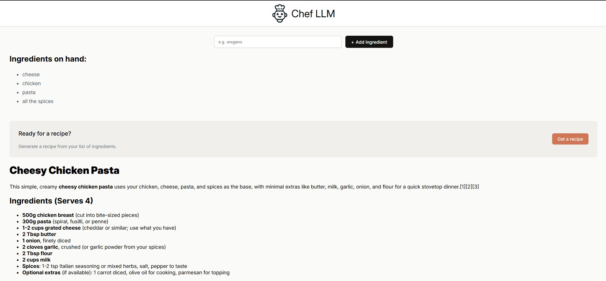
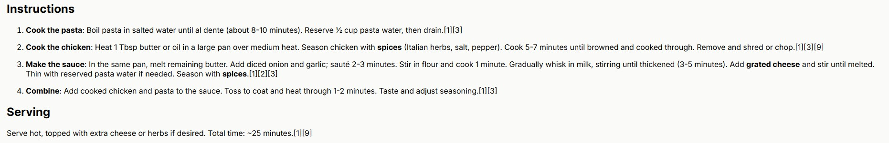
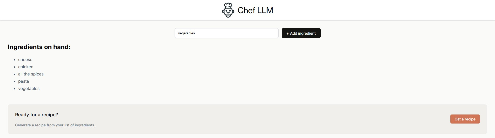
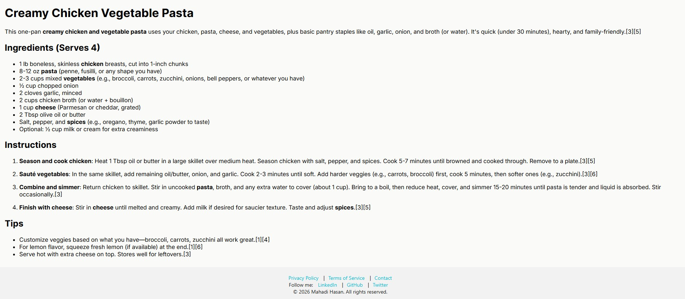

# Chef-LLM 🍳

An AI-powered recipe generator that creates delicious recipes based on the ingredients you have available. Built with React and powered by Perplexity AI.


## 🌟 Live Demo

Visit the live application: [https://chef-llm.netlify.app/](https://chef-llm.netlify.app/)

## 📋 Features

- **AI-Powered Recipes**: Generate creative recipes using Perplexity AI based on your available ingredients
- **Simple Interface**: Easy-to-use interface for adding ingredients and getting recipe suggestions
- **Responsive Design**: Works seamlessly on desktop and mobile devices
- **Real-time Updates**: Ingredients are added instantly without page refreshes
- **Recipe Display**: Beautifully formatted recipe display with ingredients and instructions

## 🛠️ Technologies Used

- **Frontend**: React 18.2.0 with Vite
- **AI Integration**: Perplexity AI API
- **Styling**: CSS3 with custom components
- **Deployment**: Netlify
- **Version Control**: Git & GitHub

## 🚀 Getting Started

### Prerequisites

- Node.js (v18.x or higher)
- npm or yarn

### Installation

1. Clone the repository:
```bash
git clone https://github.com/mahadi24t/Chef-LLM.git
cd Chef-LLM
```

2. Install dependencies:
```bash
npm install
```

3. Start the development server:
```bash
npm run dev
```

4. Open [http://localhost:5174](http://localhost:5174) in your browser to view the app.

### Build for Production

```bash
npm run build
```

## 📖 Usage

1. **Add Ingredients**: Type ingredients you have available in the input field and click "Add ingredient"
2. **Generate Recipe**: Once you've added a few ingredients, click "Get a recipe" to generate an AI-powered recipe
3. **Enjoy**: Follow the recipe instructions to create your delicious meal!

## 🖼️ Screenshots

### Initial Page


### Recipe Generation



### Netlify Deployment



## 🔧 Configuration

The app uses the Perplexity AI API for recipe generation. Make sure to configure your API keys in a `.env` file:

```env
VITE_PERPLEXITY_API_KEY=your_api_key_here
```

## 📦 Deployment

The app is configured for easy deployment on Netlify:

1. Connect your GitHub repository to Netlify
2. Set build command: `npm run build`
3. Set publish directory: `dist`
4. Add environment variables if needed
5. Deploy!

## 🤝 Contributing

Contributions are welcome! Please feel free to submit a Pull Request.

1. Fork the project
2. Create your feature branch (`git checkout -b feature/AmazingFeature`)
3. Commit your changes (`git commit -m 'Add some AmazingFeature'`)
4. Push to the branch (`git push origin feature/AmazingFeature`)
5. Open a Pull Request

## 📄 License

This project is open source and available under the [MIT License](LICENSE).

## 🙏 Acknowledgments

- Built as part of learning React and AI integration
- Powered by Perplexity AI for intelligent recipe generation
- Deployed on Netlify for seamless hosting

---

**Happy Cooking! 🍽️**
